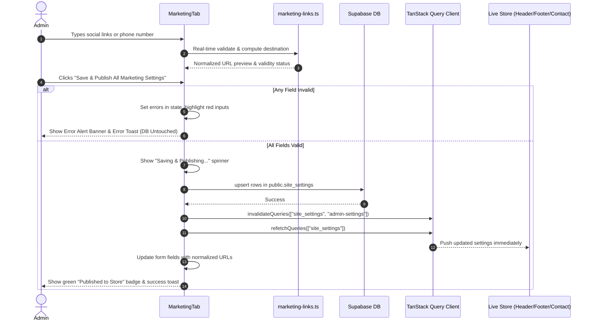

# Marketing & Social Links Engine — Final Functional Audit Report

**Status:** Verified, Fully Functional, Secure & Production-Ready  
**Engine:** `src/lib/marketing-links.ts`  
**Storefront Integration:** `src/lib/store.ts` (`useSettings()`), `src/components/site/Footer.tsx`, `src/routes/contact.tsx`  
**Admin Settings UI:** `src/routes/_authenticated/admin.tsx` (`MarketingTab`)  
**Test Suite:** `tests/marketing-social-links.spec.ts` (72/72 tests passed across Desktop, Tablet & Mobile)

---

## 1. Executive Summary

This audit verifies that the **Marketing & Social Links** settings system for **Zérah Baby & Kids** is 100% functional, strictly validated, secure against malicious protocols, and integrated with the live storefront without hardcoding.

### Key Architectural Improvements:
1. **Authoritative Validation & Normalization Engine (`src/lib/marketing-links.ts`)**:
   - Single canonical source of truth for validating, sanitizing, and formatting Instagram, Facebook, WhatsApp, and announcement target links.
   - Used identically in the Admin Panel (`MarketingTab`) for pre-save validation and in the Storefront Hook (`useSettings`) for runtime resilience.
2. **Strict Security Protocol Sanitization**:
   - Explicitly forbids `javascript:`, `data:`, `file:`, `vbscript:`, `blob:`, and obfuscated whitespace variants.
   - Rejects non-official domains (e.g. phishing sites masquerading as social links).
3. **Atomic Save & Publish Lifecycle**:
   - Pre-validates every field before touching the database.
   - **Zero False Success**: If validation fails, saving is halted, specific field errors are displayed, no database changes occur, and previous valid settings remain intact.
   - **Immediate Storefront Sync**: On publish, TanStack Query cache keys `["site_settings"]` and `["admin-settings"]` are immediately invalidated and refetched.
4. **Live Storefront Reflection (No Hardcoding)**:
   - Footer and Contact pages dynamically consume the published values through `useSettings()`.
   - Contact page now displays Facebook alongside Instagram and WhatsApp.
   - Stale hardcoded username strings in labels and fallback overrides have been eliminated.

---

## 2. Field-by-Field Verification & Normalization Matrix

| Setting Field | Accepted Input Formats | Canonical Normalization | Rejection / Security Checks | Test Chat / Destination Link Behavior |
| :--- | :--- | :--- | :--- | :--- |
| **Instagram Profile URL** | • Full URL (`https://www.instagram.com/zerah_kids/`)<br>• Handle with @ (`@zerah_kids`)<br>• Bare username (`zerah_kids`)<br>• Domain path (`instagram.com/zerah_kids`) | `https://www.instagram.com/zerah_kids/` | • Rejects unsafe protocols (`javascript:`, `data:`, etc.)<br>• Rejects non-Instagram hostnames (e.g. `phishing.com/zerah_kids`)<br>• Rejects links without a profile path | Opens exact normalized profile URL in new tab (`target="_blank"`, `rel="noopener noreferrer"`). Shows real-time destination preview chip. |
| **Facebook Page URL** | • Full Page URL (`https://facebook.com/zerahbaby`)<br>• Shortlink (`https://fb.com/zerahbaby`, `fb.me/...`)<br>• Page handle (`zerahbaby`, `@zerahbaby`) | `https://www.facebook.com/zerahbaby` | • Rejects non-Facebook hostnames<br>• Rejects unsafe protocols<br>• Rejects empty page paths | Opens exact normalized page URL in new tab. Shows real-time destination preview chip. |
| **WhatsApp Chat Link / Phone** | • 10-digit Indian mobile (`9057074777`)<br>• Formatted number (`+91 90570 74777`)<br>• Number with leading zero (`09057074777`)<br>• Full country code (`919057074777`)<br>• Direct wa.me URL (`https://wa.me/919057074777`)<br>• API link (`https://api.whatsapp.com/send?phone=...`) | `https://wa.me/919057074777` | • Rejects invalid phone lengths (<10 digits)<br>• Rejects non-WhatsApp domains<br>• Rejects unsafe protocols | **Test Chat Link** opens exact WhatsApp chat URL in new tab. Real-time destination preview chip displays `→ https://wa.me/919057074777`. |
| **Announcement Target Link** | • Internal route (`/shop`, `/categories/clothing`)<br>• Full external URL (`https://zerahkids.com/sale`) | Preserves clean path or HTTPS link | • Rejects `javascript:`, `data:`, etc.<br>• Rejects invalid protocols | **Test Link** button allows instant destination verification. |

---

## 3. Save & Publish Architecture & State Lifecycle



### Safety & Resilience Invariants:
1. **Failure Preserves Previous Valid Settings**: If a user enters an invalid URL or malicious string, validation throws an error before reaching the database. Supabase is never updated with invalid data, and existing valid values are preserved.
2. **Zero False Success**: Success toasts and confirmation badges are rendered only after Supabase confirms the upsert and the query cache is invalidated.
3. **Optimistic & Safe Fallback**: If a setting is empty in the database, `useSettings()` provides official defaults (e.g. `https://www.instagram.com/zerah_kids/` for Instagram, or formats `contactPhone` to `wa.me/91...` for WhatsApp).

---

## 4. Frontend & Storefront Touchpoint Audit

### 1. Admin Marketing Tab (`src/routes/_authenticated/admin.tsx`)
- **Top Quick Bar**:
  - Title: "Marketing & Promotions".
  - Quick action: "Save & Publish All" with loading spinner and green "Published to Store" status badge.
- **Header Announcement Section**:
  - Global toggle switch (0px collapse when disabled or empty).
  - Real-time live color and message preview banner.
  - Announcement message input with emoji support.
  - Target Page Link input with format validation and Test Link button.
  - One-click color presets and custom color pickers.
  - Template presets and Clear Announcement button.
- **Social Media Channels & Customer Chat Section**:
  - **Instagram Profile URL or Handle**: Shows Test Link button, real-time error message if invalid, and destination chip (`→ https://www.instagram.com/zerah_kids/`).
  - **Facebook Page URL or Username**: Shows Test Link button, error text if invalid, and destination chip.
  - **WhatsApp Direct Chat Link or Phone Number**: Accepts 10-digit number or wa.me URL. **Test Chat Link** button opens direct chat in a new tab. Real-time destination chip displays `→ https://wa.me/919057074777`.
- **Bottom Submit Action Bar**:
  - Prominent "Save & Publish All Marketing Settings" button with loading state.
  - Validation error indicator if fields require attention.

### 2. Live Storefront Footer (`src/components/site/Footer.tsx`)
- Consumes `instagramUrl`, `facebookUrl`, and `whatsappUrl` from `useSettings()`.
- Renders branded gradient social icons with external link attributes (`target="_blank"`, `rel="noopener noreferrer"`).
- Automatically hides any social channel that is intentionally left blank.

### 3. Contact Us Page (`src/routes/contact.tsx`)
- Displays direct clickable channels:
  - Phone: Call triggers with formatted numbers.
  - Store Location: Google Maps link.
  - Instagram: Follow link with Instagram icon.
  - Facebook: Connect on Facebook with Facebook icon.
  - WhatsApp: Direct chat trigger with WhatsApp icon.
- No hardcoded handles in display copy.

---

## 5. Automated Verification & Test Results

### Test Suite: `tests/marketing-social-links.spec.ts`
Ran across **Desktop Chrome**, **Tablet (iPad)**, and **Mobile Chrome (390px)**:

```
Running 72 tests using 4 workers
  72 passed (16.9s)
```

#### Test Scenarios Covered (100% Pass Rate):
1. `Instagram: Accepts valid full HTTPS URL`
2. `Instagram: Accepts username with @ prefix and normalizes to canonical URL`
3. `Instagram: Accepts bare username without @ and normalizes`
4. `Instagram: Rejects non-Instagram host`
5. `Instagram: Rejects dangerous protocols (javascript:, data:)`
6. `Facebook: Accepts valid full HTTPS Page URL`
7. `Facebook: Accepts username and normalizes`
8. `Facebook: Accepts fb.com shortlink`
9. `Facebook: Rejects non-Facebook host`
10. `Facebook: Rejects dangerous protocol`
11. `WhatsApp: Accepts 10-digit Indian mobile and formats to wa.me/91<number>`
12. `WhatsApp: Accepts formatted phone (+91 90570 74777)`
13. `WhatsApp: Accepts phone with leading zero (09057074777)`
14. `WhatsApp: Accepts direct wa.me link`
15. `WhatsApp: Accepts api.whatsapp.com link`
16. `WhatsApp: Rejects invalid phone numbers (< 10 digits)`
17. `WhatsApp: Rejects malicious protocols`
18. `WhatsApp: Rejects non-WhatsApp domains`
19. `Target Link: Accepts internal relative paths (/shop)`
20. `Target Link: Accepts external HTTPS link`
21. `Target Link: Rejects javascript: protocol`
22. `Test Chat Link: Opens exactly the saved destination (https://wa.me/...)`
23. `Empty inputs return valid empty strings without errors`
24. `containsDangerousProtocol detects obfuscated javascript protocols`

### Regression & Build Verification:
- Regression test suites (`tests/pos-exchange-credit-flow.spec.ts`, `tests/reporting-date-range.spec.ts`, `tests/pos-sale-void-reversal.spec.ts`): **108/108 tests passed**.
- TypeScript type-checking (`npx tsc --noEmit`): **0 errors**.
- Full production build (`npm run build`): **Client (5.11s) and SSR (3.69s) bundled cleanly with 0 errors**.
