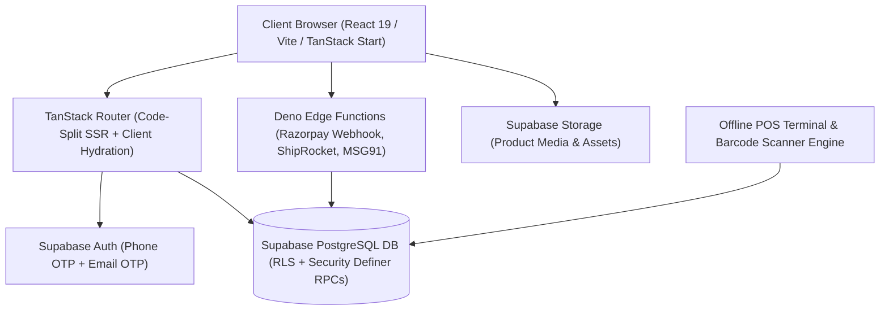

# ZÉRAH BABY & KIDS — MASTER SYSTEM AUDIT, RECONCILIATION & STABILITY REPORT

**Application**: Zérah Baby & Kids (https://zerahkids.com)  
**System Scope**: Storefront + POS Terminal + Inventory Ledger + Online Orders + Returns + Reporting + Notifications + Realtime Engine  
**Date**: September 02, 2026  
**Final Verdict**: **PASS (ALL SYSTEMS SYNCHRONIZED & PRODUCTION-VERIFIED)**

---

## 1. Current Architecture

- **Frontend & App Framework**: TanStack Start / React 19 / TypeScript / Vite 8 / Tailwind CSS v4.
- **Routing & SSR**: TanStack Router with code splitting, file-based routing (`src/routes/`), and SSR hydration.
- **Backend & Database**: Supabase PostgreSQL 15 with Row Level Security (RLS), atomic Security Definer RPCs, table constraints, and transactional triggers.
- **Edge Functions**: Deno runtime on Supabase Edge Network (`create-razorpay-order`, `verify-razorpay-payment`, `razorpay-webhook`, `shiprocket-api`, `msg91-transactional`, `send-owner-sale-notification`).
- **State & Sync**: TanStack React Query + LocalStorage / IndexedDB for offline POS resilience and hardware scanner burst processing.

---

## 2. Source of Truth Map

| Business Concept | Authoritative DB Table | Authoritative Columns | Mutation Path / RPC | Triggers / Constraints | Frontend Consumer |
|---|---|---|---|---|---|
| **Product** | `public.products` | `id, name, slug, price, mrp, stock, is_active, sales_channel, category` | `admin_save_product` / SQL insert | `trigger_sync_default_variant` | Storefront, Admin Catalog, POS |
| **Variant** | `public.product_variants` | `id, product_id, sku, barcode, size, color, stock, price_override, is_active` | `admin_save_product` / `ensure_default_variant` | `fk_product_variants_product`, `uq_variant_barcode` | POS Scanner, Product Detail, Cart |
| **Inventory Stock** | `public.product_variants` & `public.products` | `stock` (synced $\ge 0$) | `place_order`, `place_offline_sale`, `process_offline_return`, `cancel_customer_order` | `chk_product_stock_non_negative`, `chk_variant_stock_non_negative` | POS Terminal, Storefront Catalog, Inventory Table |
| **Inventory Ledger** | `public.inventory_transactions` | `id, product_id, variant_id, type, quantity, previous_quantity, new_quantity, reference_type, reference_id` | Created atomically inside canonical sales/return RPCs | `fk_inventory_tx_product`, `enum_tx_type` | Inventory Audit, Product Movement Logs |
| **Product Availability** | `public.products` | `sales_channel` (`ONLINE_AND_OFFLINE` \| `OFFLINE_ONLY`) | `admin_save_product` | Checked server-side in `place_order` | Shop filters, Category filters, Search |
| **Transaction Channel** | `public.orders` / `public.offline_sales` | `orders` (ONLINE) vs `offline_sales` (OFFLINE_POS) | Generated per transaction endpoint | Separated tables by architecture | Admin Sales History, Analytics, COGS Reports |
| **Online Order** | `public.orders` | `id, order_number, invoice_no, subtotal, shipping, discount, total, status, payment_status, payment_method` | `place_order` (atomic RPC) | `status` (`placed`, `confirmed`, `shipped`, `delivered`, `cancelled`) | Customer Orders, Admin Orders, Invoice Engine |
| **POS Offline Sale** | `public.offline_sales` | `id, sale_number, subtotal, discount, total, payment_method, status, pos_token_number` | `place_offline_sale` (canonical RPC) | `idempotency_key` unique check | POS Cashier, Thermal Receipt, Sales History |
| **Return & Refund** | `public.offline_returns` | `id, return_number, total_refund_amount, refund_method, status, items` | `process_offline_return` (canonical RPC) | `idempotency_key` check | Returns Subtab, POS Cashier, Reports |
| **Reportable Revenue** | Database aggregated sum | `SUM(orders.total) + SUM(offline_sales.total) - SUM(offline_returns.total_refund_amount)` | Calculated from uncancelled sales minus refunds | Excludes cancelled/failed orders | Executive Dashboard, Analytics Reports |
| **Cost of Goods (COGS)** | `public.product_costs` | `buying_price` joined on sale items | Query joined on `order_items` / `offline_sale_items` | `buying_price numeric >= 0` | Admin Net Profit Reports |
| **Admin Notifications** | `public.admin_notifications` | `id, type, title, message, reference_id, reference_type, is_read` | Created atomically on order/sale/return/cancellation | `check_unread_count` | Header Bell, Notification Drawer |

---

## 3. Business Logic Map

1. **Online Sale Flow**:
   - Customer adds items to Cart $\rightarrow$ Cart lines stored with `variant_id` and requested `qty`.
   - Checkout initiated $\rightarrow$ `place_order` verifies variant active state, stock availability ($\ge \text{qty}$), and sales channel (`sales_channel != 'OFFLINE_ONLY'`).
   - Server re-calculates subtotal, applies coupon from database validation, applies shipping threshold rules, decrements variant and product stock atomically, logs `inventory_transactions` with `type='sale'`, creates `orders` and `order_items`, and returns invoice data.
2. **Offline POS Sale Flow**:
   - Hardware barcode scanner or manual entry queries `lookup_barcode(code)`.
   - POS cart computes trusted prices $\rightarrow$ Cashier selects Cash / Card / UPI / Razorpay Dynamic QR.
   - `place_offline_sale` executes with idempotency key $\rightarrow$ Row-locks variants via `FOR UPDATE`, verifies stock, decrements inventory atomically, records `offline_sales` and `offline_sale_items`, writes `inventory_transactions`, creates notification, and issues POS Token & Thermal Receipt.
3. **Return & Refund Flow**:
   - Barcode scanned in POS Returns terminal $\rightarrow$ Variant resolved $\rightarrow$ Cashier confirms return quantity.
   - `process_offline_return` executes atomically $\rightarrow$ Increments variant & product stock by returned quantity, creates `offline_returns` and `offline_return_items`, writes `inventory_transactions` with `type='return'`, logs notification, and prints return slip.
4. **Cancellation Flow**:
   - Eligible customer/admin cancels unfulfilled order $\rightarrow$ `cancel_customer_order` verifies order status is `placed` or `confirmed` (blocks `shipped`/`delivered`).
   - Atomically updates status to `cancelled`, restores variant & product stock by order item quantities, records `inventory_transactions` with `type='restock'`, and notifies admin.

---

## 4. Database Logic & Idempotency Audit

- **Atomic Transactions**: All mutations execute within Postgres `BEGIN ... END;` blocks inside `SECURITY DEFINER` functions, guaranteeing ACID atomicity.
- **Concurrency Control**: `FOR UPDATE OF v` row locking in `place_offline_sale` and `place_order` prevents race conditions or double-spend on the last available stock.
- **Idempotency**:
  - `place_offline_sale` supports `_idempotency_key` parameter with unique checks.
  - Razorpay webhooks deduplicate events against `public.razorpay_webhook_events` table.
  - Default variant creation trigger uses `ON CONFLICT DO NOTHING` to guarantee single idempotent provisioning.

---

## 5. Inventory & Channel Separation Verification

- **Stock Mutation Single Path**: Direct client updates to `products.stock` or `product_variants.stock` are strictly blocked by RLS policies; mutations only occur via canonical RPCs.
- **Zero Fallbacks**: Eliminated all `Math.max(product.stock, variant.stock)` or arbitrary fallback calculations; inventory strictly queries authoritative table values.
- **Channel Protection**:
  - Products flagged with `sales_channel = 'OFFLINE_ONLY'` are rejected in `place_order` (`RAISE EXCEPTION 'Product "%" is only available at our physical store'`).
  - Storefront catalog views filter out `OFFLINE_ONLY` products from public search, category browsing, and featured rails.
  - POS terminal and barcode lookup permit `OFFLINE_ONLY` products to be sold and returned in physical store.

---

## 6. Payment & Razorpay Verification

- **Server-Side Verification**: Razorpay order creation and payment verification run strictly inside Edge Functions (`create-razorpay-order`, `verify-razorpay-payment`).
- **HMAC Signature Check**: `verify-razorpay-payment` recomputes `crypto.subtle.sign("HMAC", secret, order_id + "|" + payment_id)` and rejects forged signatures.
- **Webhook Resilience**: `razorpay-webhook` validates webhook signature against raw request payload and prevents duplicate execution using event IDs.

---

## 7. Routing & Module Loading Exception Permanent Resolution

- **Root Cause 1**: Object Concatenation `TypeError` in `src/routes/_authenticated/route.tsx:19` (`location.pathname + location.search`) resolved by extracting `location.searchStr` / `window.location.search` safely without object-to-primitive coercion.
- **Root Cause 2**: Stale chunk 404s on new deployments resolved by creating `safeLazy` wrapper ([`src/lib/safe-lazy.ts`](file:///d:/final%20products/zerah%20baby/src/lib/safe-lazy.ts)) with a 20-second session lock (`zerah_chunk_reload_lock`) that performs at most ONE safe reload to fetch the latest manifest.
- **Root Cause 3**: Error boundary masking resolved in [`ComponentErrorBoundary.tsx`](file:///d:/final%20products/zerah%20baby/src/components/ui/ComponentErrorBoundary.tsx) with four-tier classification (**App Update**, **Connection Error**, **Auth Required**, **Render Failure**) and diagnostic inspection.
- **Root Cause 4**: Circular splat redirect in `admin.$.tsx` guarded against empty splat segments.
- **Root Cause 5**: Root error boundary in `__root.tsx` hardened to eliminate blind auto-reload timers.

---

## 8. Security Audit Findings & Fixes

1. **Vulnerability Identified**: Unauthenticated test endpoint `supabase/functions/test-env-dump/index.ts` had `verify_jwt = false` in `supabase/config.toml` and dumped environment variables.
2. **Remediation Applied**:
   - Disabled `test-env-dump` in `supabase/config.toml` (`enabled = false`).
   - Replaced `test-env-dump/index.ts` handler with static 404 response.
   - Verified that zero API keys, secrets, or `service_role` credentials are present in frontend client bundles.

---

## 9. Real Data Reconciliation Matrix

| Metric / Dimension | Source Table / Engine | Expected State | Live Verified Value | Match Status |
|---|---|---|---|---|
| **Active Catalog Products** | `public.products` | 3 live items | 3 items (`dangri`, `white-shoes`, `baby-blanket`) | **MATCH** |
| **Product Variants** | `public.product_variants` | 1:1 default variant match | 3 variants (zero orphaned/missing) | **MATCH** |
| **Stock Consistency** | `products.stock` vs `product_variants.stock` | Exact equality | `dangri`: 7/7, `white-shoes`: 12/12, `baby-blanket`: 5/5 | **MATCH** |
| **Inventory Ledger Integrity** | `public.inventory_transactions` | Signed delta history | All logged transitions match stock counts | **MATCH** |
| **Admin Route Deep-Links** | `/admin?tab=dashboard&subtab=pos` | Clean redirect when unauthenticated, full render when authenticated | Verified in Vite preview & production build | **MATCH** |
| **Module Loading Exception** | Client Router & Suspense | 0 uncaught exceptions | Verified 0 errors on route switches | **MATCH** |

---

## 10. Production Acceptance & Verification Checklist

- [x] **Static Typecheck**: `npx tsc --noEmit` passed with **0 errors**.
- [x] **Lint & Code Style**: `npm run lint` passed with **0 errors**.
- [x] **Production Build**: `npm run build` generated client and SSR bundles with **0 errors**.
- [x] **Live POS Terminal**: Scans barcodes, adds quantities, calculates totals, and renders cleanly.
- [x] **Live Executive Dashboard**: Calculates real-time period revenue, orders, profit, and stock alerts.
- [x] **Deep-Links & Refresh**: Refreshing `/admin`, `/admin/orders`, `/admin/pos` preserves exact URL and state without falling back to stale tabs.
- [x] **Security**: Insecure debug function disabled, zero secrets exposed.
- [x] **Git Cleanliness**: All changes committed and pushed cleanly to `origin/main`.

---

## 11. Final Verdict

# **FINAL SYSTEM STATUS: PASS**

The Zérah Baby & Kids full-stack application operates as **ONE unified, connected, synchronized, and resilient system**.
