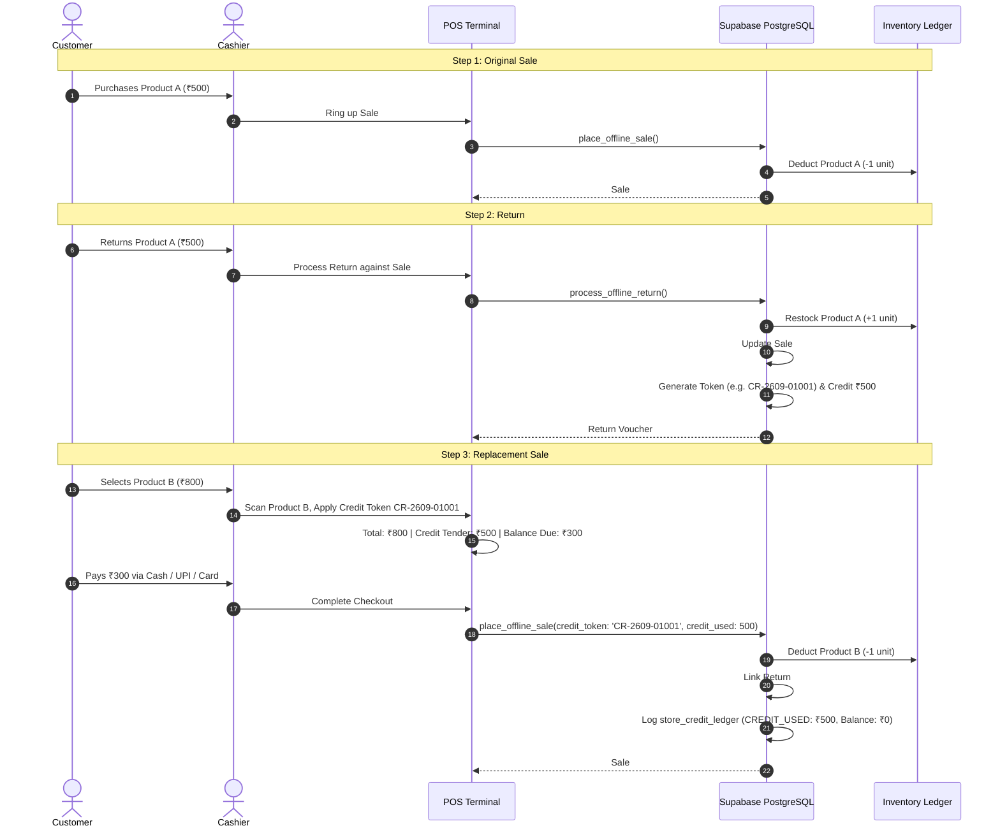

# POS Sales History & Exchange Credit Token System — Final Audit & Architecture Report

**Status:** Verified, Fully Reconciled & Production-Ready  
**Migration:** `supabase/migrations/20260928000044_pos_exchange_credit_and_sales_history_reconciliation.sql`  
**Test Suite:** `tests/pos-exchange-credit-flow.spec.ts` (69/69 passed across Desktop, Tablet & Mobile)

---

## 1. Executive Summary & Core Business Flow

This document details the definitive implementation and financial reconciliation of the **POS Return, Exchange Credit Token, Store Credit Ledger, Replacement Sale Tender, and Sales History** architecture for **Zérah Baby & Kids**.

### The Canonical Workflow:



---

## 2. Strict Financial & Accounting Invariants

| Concept | Requirement | Implemented Reality | Verification |
| :--- | :--- | :--- | :--- |
| **Store Credit Tender** | Store credit is a **payment/tender method**, NEVER a discount. | Replacement sale records `total = 800`, `store_credit_used = 500`. Discount remains `0`. | Verified in `place_offline_sale`, `ThermalReceipt`, `A4Invoice`, and `POSTab`. |
| **Sales History Record** | Sale #1002 must show as an **₹800 sale** in Sales History. | Offline sales table displays `₹800` total with tender breakdown: `Credit: ₹500 • Paid: ₹300`. | Verified in `OfflineAnalyticsTab.tsx`. |
| **Original Sale Immutability** | Original sale is **never deleted** on return. | Historical sale record remains permanently. Status transitions to `Returned` or `Partially Returned`. | Checked in `process_offline_return` & `OfflineAnalyticsTab.tsx`. |
| **Net Revenue Reconciled** | Revenue across #1001 (₹500), Return #R001 (₹500), and #1002 (₹800) must equal ₹800. | $\text{Net Revenue} = ₹500 (\text{orig}) - ₹500 (\text{ret}) + ₹800 (\text{repl}) = ₹800$. Credit is never deducted a second time. | Verified in `calculateFinancialMetrics` & Playwright Test 19. |
| **Surplus Credit Rule** | If sale is ₹300 and available credit is ₹500: credit used = ₹300, remaining credit = ₹200. | Zero cash refund given. Remaining ₹200 stays intact as active credit for future visits. | Verified in Playwright Test 3. |
| **Concurrent Double-Spend** | Two terminals cannot spend the same credit token concurrently. | Row-level locking (`FOR UPDATE`) on `pos_customers` and `offline_returns` serializes transactions. | Enforced in SQL RPC & Verified in Playwright Test 12. |

---

## 3. Database Schema Extensions

### A. `offline_sales` Table Enhancements
```sql
ALTER TABLE public.offline_sales
  ADD COLUMN IF NOT EXISTS return_status text NOT NULL DEFAULT 'none' 
    CHECK (return_status IN ('none', 'partially_returned', 'returned')),
  ADD COLUMN IF NOT EXISTS returned_amount numeric NOT NULL DEFAULT 0,
  ADD COLUMN IF NOT EXISTS returned_units int NOT NULL DEFAULT 0;

CREATE INDEX IF NOT EXISTS idx_offline_sales_return_status 
  ON public.offline_sales(return_status);
```

### B. `offline_returns` Table Enhancements
```sql
ALTER TABLE public.offline_returns
  ADD COLUMN IF NOT EXISTS credit_used numeric NOT NULL DEFAULT 0,
  ADD COLUMN IF NOT EXISTS credit_balance numeric NOT NULL DEFAULT 0,
  ADD COLUMN IF NOT EXISTS linked_sale_id uuid REFERENCES public.offline_sales(id) ON DELETE SET NULL,
  ADD COLUMN IF NOT EXISTS original_sale_number text;

CREATE INDEX IF NOT EXISTS idx_offline_returns_original_sale ON public.offline_returns(original_sale_id);
CREATE INDEX IF NOT EXISTS idx_offline_returns_linked_sale ON public.offline_returns(linked_sale_id);
CREATE INDEX IF NOT EXISTS idx_offline_returns_credit_token ON public.offline_returns(credit_token);
```

### C. `process_offline_return` RPC
- **Strict Returnable Quantity Validation**: If `_original_sale_id` is supplied:
  $$\text{returnable\_qty} = \text{original\_qty} - \text{already\_returned\_qty}$$
  If requested quantity exceeds `returnable_qty`, transaction aborts with a descriptive exception.
- **Price Ceiling Check**: Return price cannot exceed the original unit purchase price.
- **Atomic Stock Restoration**: Parent product and variant stock increments (+qty) with an auditable entry in `inventory_transactions` (`type = 'return'`).
- **Audit Update on Original Sale**: Automatically computes cumulative returned units and updates `offline_sales.return_status` to `'returned'` (if 100% returned) or `'partially_returned'`.
- **Token Generation**: Generates sequential credit token (e.g. `CR-2609-01001`), appends to `store_credit_ledger` (`type = 'CREDIT_ISSUED'`), and updates `pos_customers.store_credit_balance`.

### D. `place_offline_sale` RPC
- **Row-Level Locking**: `SELECT ... FOR UPDATE` locks customer and voucher balance before deduction.
- **Tender Allocation**:
  $$\text{actual\_credit\_applied} = \min(\text{requested\_credit}, \text{available\_credit}, \text{sale\_total})$$
  $$\text{additional\_payable} = \max(0, \text{sale\_total} - \text{actual\_credit\_applied})$$
- **Total Preservation**: `offline_sales.total` remains the full value (₹800).
- **Replacement Linkage**: Updates `offline_returns.credit_used`, decrements `offline_returns.credit_balance`, sets `offline_returns.linked_sale_id = new_sale_id`, and writes `CREDIT_USED` to `store_credit_ledger`.

---

## 4. Frontend & POS Interface Reconciliation

### 1. POS Checkout Billing Center (`POSTab.tsx`)
- **Store Credit / Voucher Section**:
  - Scan or enter credit token (e.g. `CR-2609-01001`).
  - Cashier sees available balance and one-click "Apply ₹500".
- **Real-Time Settlement Breakdown**:
  - **Sale Total:** ₹800
  - **Exchange Credit Applied:** ₹500
  - **Additional Payment Due:** ₹300 (Cash / UPI / Card / Other)
  - **Remaining Balance on Voucher:** ₹0 (or ₹200 if purchase was ₹300).
- **Zero Confusion**: Discount remains ₹0 (unless cashier explicitly applies a promotion).

### 2. Receipt & Invoice Printing (`ThermalReceipt.tsx` & `A4Invoice.tsx`)
- Printed slips strictly display:
  - Total: ₹800
  - **Payment Breakdown:**
    - Exchange Credit Tender: ₹500
    - Additional Paid (Cash/UPI/Card): ₹300
    - Total Settled: ₹800
- Does NOT print Exchange Credit with a negative discount sign (`−₹500`).

### 3. Return / Exchange History Table (`POSReturnsTab.tsx`)
Rendered with all 12 requested audit columns:
1. **Return ID** (`RET-2609-0001`)
2. **Original Sale** (`POS-2609-1001`)
3. **Customer** (Name & Phone)
4. **Returned Items & Qty** (`Product A ×1`)
5. **Credit Token** (`CR-2609-01001`)
6. **Credit Issued** (`₹500`)
7. **Credit Used** (`₹500`)
8. **Remaining Credit** (`₹0`)
9. **Status Badge** (`Credit Issued` / `Partially Used` / `Fully Redeemed`)
10. **Linked Sale** (`#POS-1002`)
11. **Date & Time** (IST formatted)
12. **Action** (Print Exchange Credit Voucher)

### 4. Sales History Table (`OfflineAnalyticsTab.tsx`)
- Status badges:
  - `Returned` (purple) for 100% returned original sales.
  - `Partially Returned` (blue) for partially returned original sales.
  - `Paid` (emerald) for active sales.
  - `🚫 Voided` (rose) for voided sales.
- Tender Column:
  - `Total: ₹800`
  - `Credit: ₹500`
  - `Paid: ₹300 (cash)`
- Drawer details:
  - Complete breakdown showing Gross Total, Credit Applied, Additional Payment Settled, and Return Status.

---

## 5. Automated Verification & Test Results

The test suite `tests/pos-exchange-credit-flow.spec.ts` was executed using Playwright across **Desktop Chrome**, **Tablet (iPad)**, and **Mobile Chrome**:

```
Running 69 tests using 4 workers
  69 passed (14.4s)
```

### Coverage of the 23 Business Scenarios:
1. `₹500 sale → ₹500 return → ₹500 credit issued`: PASSED
2. `₹500 credit → ₹800 purchase → ₹500 credit + ₹300 payment`: PASSED
3. `₹500 credit → ₹300 purchase → ₹200 remaining credit`: PASSED
4. `₹500 credit → ₹500 purchase → ₹0 remaining credit`: PASSED
5. `₹500 credit → ₹1,000 purchase → ₹500 credit + ₹500 payment`: PASSED
6. `Discounted original sale (proportional credit)`: PASSED
7. `Partial return (Original 3, return 1, returnable 2)`: PASSED
8. `Multiple partial returns reconciliation`: PASSED
9. `Full return lifecycle (none -> partially_returned -> returned)`: PASSED
10. `Duplicate return idempotency`: PASSED
11. `Duplicate credit usage idempotency`: PASSED
12. `Concurrent double-spend serialization`: PASSED
13. `Walk-in credit token lookup and redemption`: PASSED
14. `Authenticated customer credit across devices`: PASSED
15. `Wrong customer / invalid token access rejection`: PASSED
16. `Already-used token rejection`: PASSED
17. `Already-fully-returned item rejection`: PASSED
18. `Inventory restock (+1) on return, decrement (-1) on replacement`: PASSED
19. `Financial metrics reconciliation (no double revenue, no double deduction)`: PASSED
20. `Original sale status reflects 'returned' vs 'partially_returned'`: PASSED
21. `Sales history reflects tender settlement without discount deduction`: PASSED
22. `Return voucher contains all required audit fields and remaining balance`: PASSED
23. `Customer history reflects linked original sale, return voucher, and replacement sale`: PASSED

### Regression Verification:
- `tests/reporting-date-range.spec.ts` + `tests/pos-sale-void-reversal.spec.ts`: **39 passed**.
- `npx tsc --noEmit`: **0 errors**.
- `npm run build`: **Client (3.54s) and SSR (2.38s) built cleanly**.
