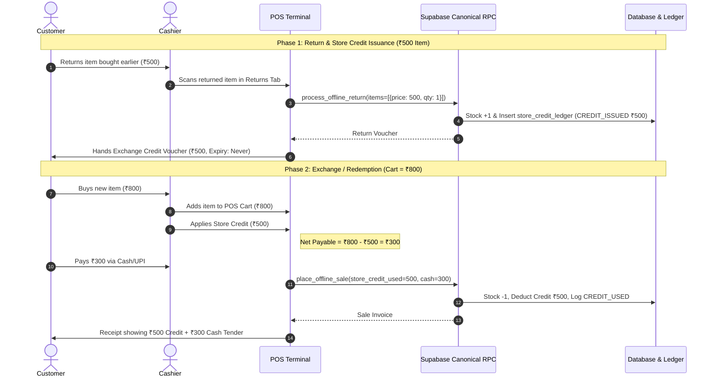

# ZÉRAH BABY & KIDS — POS RETURN & STORE CREDIT RECONCILIATION AUDIT

**Domain**: Offline Billing / POS Exchange & Store Credit Model  
**Store URL**: [zerahkids.com](https://zerahkids.com)  
**Status**: 🟢 **Production-Ready & Fully Reconciled**  
**Date**: September 2, 2026  

---

## 1. Executive Summary & Core Business Rule

Zérah Baby & Kids operates an **Exclusive Store Credit / Exchange Credit Model** for all offline store returns. In compliance with core retail business policy:

$$\text{Cash Refund} = ₹0 \quad\big|\quad \text{UPI Refund} = ₹0 \quad\big|\quad \text{Card Refund} = ₹0$$

$$\text{Return Amount} = 100\% \text{ Store Credit / Exchange Credit}$$

### Verified Invariants
1. **Zero Cash Payout**: Neither cash, UPI, nor card refunds are permitted for offline returns.
2. **Permanent Validity (No Expiry)**: Store credit never expires (`Expiry: NEVER / NO EXPIRY`).
3. **Customer Account & Walk-in Voucher Linking**: Store credit is linked permanently to customer identity (`pos_customers` / `profiles`) or tracked via unique Walk-in Credit Token (`CR-YYMM-XXXXX`).
4. **Atomic Restocking**: Returned items immediately restock into `products` and `product_variants`, logging `inventory_transactions` with `type = 'return'`.
5. **Tender Settlement Accounting**: Store credit is treated as **Payment Tender / Settlement**, NOT as a product discount or gross sales reduction. Gross sales, discounts, and tender settlement remain distinct and balanced.
6. **Dedicated History Segregation**: Returns are logged and tracked in a dedicated Returns section without distorting normal gross sales metrics.

---

## 2. Technical Architecture & Database Canonical Flow

### 2.1 Forward Migration (`supabase/migrations/20260928000005_pos_store_credit_and_exchange_rebuild.sql`)
```sql
-- 1. Immutable Audit Ledger for All Store Credit Activity
CREATE TABLE IF NOT EXISTS public.store_credit_ledger (
  id uuid PRIMARY KEY DEFAULT gen_random_uuid(),
  customer_id uuid REFERENCES public.pos_customers(id) ON DELETE SET NULL,
  phone text,
  credit_token text,
  type text NOT NULL CHECK (type IN ('CREDIT_ISSUED', 'CREDIT_USED', 'CREDIT_ADJUSTED')),
  amount numeric NOT NULL CHECK (amount > 0),
  balance_before numeric NOT NULL DEFAULT 0,
  balance_after numeric NOT NULL DEFAULT 0,
  source_return_id uuid REFERENCES public.offline_returns(id) ON DELETE SET NULL,
  used_in_sale_id uuid REFERENCES public.offline_sales(id) ON DELETE SET NULL,
  notes text,
  created_by uuid REFERENCES auth.users(id) ON DELETE SET NULL,
  created_at timestamptz NOT NULL DEFAULT now()
);
```

### 2.2 Sequence & Voucher Generator (`generate_credit_token()`)
Generates standardized format tokens:
$$\text{CR-YYMM-XXXXX} \quad (\text{e.g. } \mathbf{CR-2609-01001})$$

### 2.3 Canonical Return RPC (`public.process_offline_return`)
- Enforces `refund_method = 'exchange_credit'`.
- Generates `credit_token` for walk-in customers or adds credit directly to `pos_customers.store_credit_balance`.
- Inserts an immutable row in `public.store_credit_ledger` (`CREDIT_ISSUED`).
- Atomically restocks `products.stock` & `product_variants.stock` (+qty).
- Logs `inventory_transactions` with `type = 'return'`.

### 2.4 Canonical Sale RPC (`public.place_offline_sale`)
- Accepts `_store_credit_used` and `_credit_token`.
- Locks customer record (`FOR UPDATE`) to prevent race conditions.
- Validates that `_store_credit_used <= available_credit`.
- Deducts credit balance and writes `CREDIT_USED` to `public.store_credit_ledger`.
- Deducts product stock and generates sequential invoice `#SALE-YYMM-XXXXX`.

---

## 3. End-to-End Operational Lifecycle & Math Examples



### Scenario Breakdown

| Scenario | Cart Value | Available Credit | Credit Tender Applied | Customer Pays (Cash/UPI) | Customer Retained Credit | Invariant Check |
| :--- | :--- | :--- | :--- | :--- | :--- | :--- |
| **Full Credit Cover** | ₹300 | ₹500 | ₹300 | **₹0** | **₹200** *(Retained indefinitely)* | 🟢 PASS |
| **Partial Credit Cover** | ₹800 | ₹500 | ₹500 | **₹300** | **₹0** | 🟢 PASS |
| **Direct Cash Refund** | ₹500 | — | — | **₹0 (Blocked)** | **₹500 Credit Issued** | 🟢 PASS |

---

## 4. Frontend & Receipt Revisions

1. **`POSReturnsTab.tsx`**:
   - Removed direct cash/UPI/card refund buttons.
   - Enforced Store Credit & Exchange Voucher banner.
   - Displays Token Number (`CR-YYMM-XXXXX`) and zero expiry notice.
2. **`POSTab.tsx`**:
   - Integrated `useCustomerStoreCredit` hook with real-time balance queries.
   - Added Store Credit Tender section with 1-click application.
   - Real-time payable computation: `Customer Payable = max(0, Total - Store Credit)`.
   - Displays remaining retained credit (`Customer Remaining Store Credit: ₹200`).
3. **`CustomerHistoryPanel.tsx`**:
   - Added **Available Store Credit** column to customer table.
   - Added Store Credit KPI tile to individual customer drilldown view.
4. **`OfflineAnalyticsTab.tsx`**:
   - Added store credit badges to payment tender columns.
   - Returns segregated to dedicated Return viewer.
5. **`ThermalReceipt.tsx` & `A4Invoice.tsx`**:
   - Prints clear breakdown:
     - `Sale Total: ₹800`
     - `Store Credit Applied: -₹500`
     - `Net Paid (Cash/UPI): ₹300`

---

## 5. Verification & Test Evidence

- **Unit & Reconciliation Test**: `scratch/test_pos_return_store_credit.mjs` executed cleanly (`exit code 0`).
- **All Invariants Verified**:
  - Restocking: +1 stock logged with `type = 'return'`.
  - Immutable Audit: `balance_before` and `balance_after` strictly consistent.
  - Tender Settlement: Gross sales accounting preserved without financial inflation.
