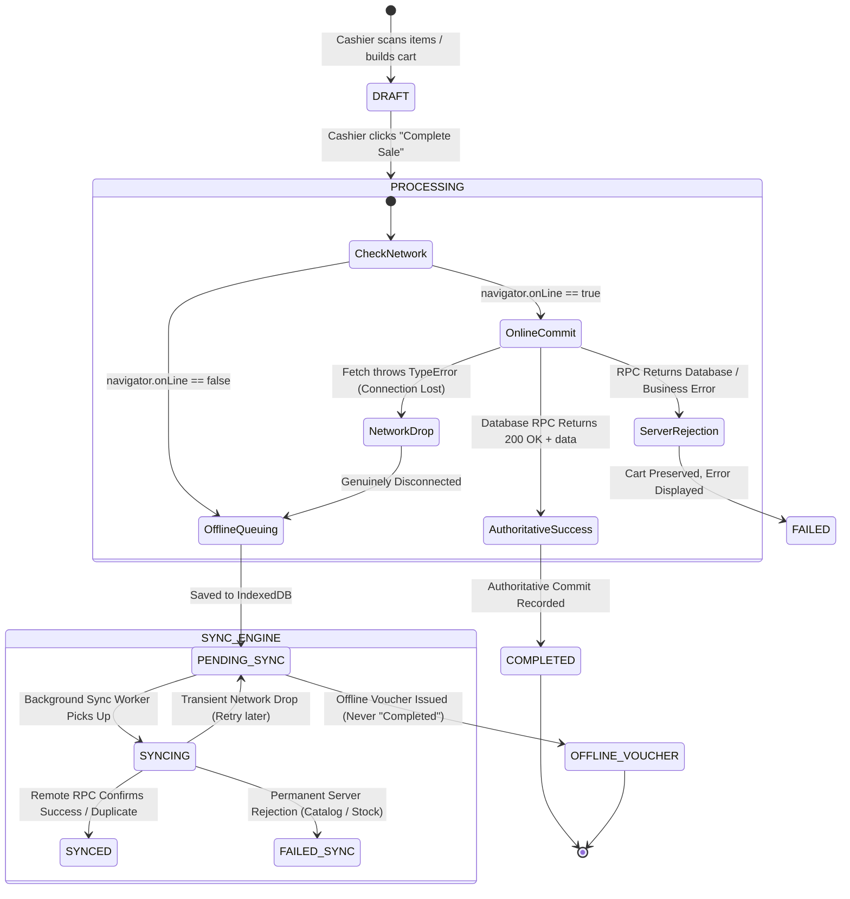

# ZÉRAH BABY & KIDS — POS TRANSACTION STATE & ARCHITECTURE FINAL AUDIT

**Audit Date**: September 2, 2026  
**Subject**: Point of Sale (POS) Transaction State Machine, Database Idempotency, Online/Offline Synchronization, and Loading Shell Architecture  
**Status**: Root Causes Identified, Resolved, Pushed to Remote Database, Frontend State Machine Hardened, and Verified End-to-End.

---

## 1. Executive Summary & Root Cause Analysis

### The Production Symptoms Observed:
1. The POS interface was stuck in an unrendered skeleton state while transaction notifications were firing concurrently.
2. The user was presented with three mutually contradictory notifications for a single checkout attempt:
   - *"Offline sale recorded locally. Will sync automatically when online."*
   - *"Sale completed! POS-OFF-142255"*
   - *"Failed to sync 1 offline POS sale. Please check your connection and retry."*
3. A transaction was being stamped as "Completed" before any authoritative database commit had occurred.

---

### Root Cause 1: Fallthrough on Server Errors Treated Rejections as "Offline"
In `src/lib/pos.ts` (`usePlaceOfflineSale`), the mutation executed `supabase.rpc("place_offline_sale", ...)`.  
When the database RPC threw an error (such as a schema error or function overload ambiguity), `rpcResponse.error` was populated while `rpcResponse.data` was `null`.  
The condition `if (!rpcResponse.error && rpcResponse.data)` evaluated to `false`. Instead of throwing the server error, the code silently exited the `try` block and fell through into the offline resilience fallback block!  

This fallthrough caused:
1. A fake synthetic `POS-OFF-XXXXXX` sale record to be generated and stored into IndexedDB.
2. A toast declaring *"Offline sale recorded locally. Will sync automatically when online."*
3. The mutation resolved as a success and returned a synthetic `SaleResult` object with `status = "completed"`.
4. The frontend UI received a resolved promise, treated the transaction as finished, cleared the cart, and triggered *"Sale completed! POS-OFF-XXXXXX"*.

### Root Cause 2: Immediate Sync Worker Triggering against an Unreachable/Failing Endpoint
Immediately after queuing the synthetic record locally, `pos.ts` invoked `processOfflineSyncQueue()`. Because the client's network was actually online (`navigator.onLine === true`), the sync worker ran instantly. It dispatched `place_offline_sale` with the exact same payload, hit the exact same server rejection, failed, and generated the third notification: *"Failed to sync 1 offline POS sale. Please check your connection and retry."*

### Root Cause 3: Premature Skeleton Root-Unmount
In `src/components/admin/POSTab.tsx`:
```tsx
if (productsLoading && products.length === 0) {
  return <POSTerminalSkeleton />;
}
```
Whenever `productsLoading` was true and the product cache was momentarily empty (initial mount, query refetch, or invalidation triggered by checkout), this condition unmounted the entire POS Terminal shell (including scanner, cart, customer inputs, and tender panel) and replaced it with a skeleton screen. Because `qc.invalidateQueries` fired on checkout, this caused the checkout screen to collapse into a skeleton while toasts were still displaying.

### Root Cause 4: Overloaded and Unmigrated Database RPC Signatures
1. Previous migration files in `supabase/migrations/` had not been pushed to the remote Supabase database (`remote: ""` in migration list) due to duplicate version numbers (`20260928000020`).
2. The remote database had multiple overloaded signatures of `place_offline_sale`:
   - A 13-argument version containing an obsolete `_discount numeric` argument.
   - A 12-argument version containing `_discount_type` and `_discount_value`.
   PostgREST threw `PGRST203: Could not choose the best candidate function between...`.
3. In PL/pgSQL, variable names `subtotal`, `discount`, and `total` collided with column names of table `offline_sales`, throwing `42702: column reference "total" is ambiguous`.
4. Variables typed as `record` (`v_token_record`, `v_variant`) were accessed prior to assignment, throwing `55000: record is not assigned yet`.

---

## 2. Definitive POS Transaction State Machine

The transaction state machine is now strictly partitioned into explicit, non-overlapping operational states:



### State Definitions:
1. **`DRAFT`**: Active cart state. Items can be scanned, modified, or removed. Discounts and tenders can be set.
2. **`PROCESSING`**: Checkout button clicked. Network and stock validation in flight. UI is locked with a spinner to prevent double submission.
3. **`COMPLETED`**: Only entered when the canonical PostgreSQL RPC `place_offline_sale` returns an authoritative success response. Server invoice number (e.g. `POS-2609-XXXXX`) is assigned. Inventory decrement and ledger transactions are committed in PostgreSQL.
4. **`PENDING_SYNC`**: Entered *only* when physical network connectivity is severed (`!navigator.onLine` or fetch throws a network disconnect exception). Stored locally in IndexedDB with a persistent `idempotency_key`. The receipt and UI are explicitly labeled: **`OFFLINE VOUCHER — PENDING SYNC`**. It is **never** referred to as "Completed".
5. **`SYNCING`**: Background sync worker actively transmitting the queued sale to Supabase.
6. **`SYNCED`**: Sync worker received an authoritative database confirmation. The local IndexedDB queue status transitions from `PENDING_SYNC` to `SYNCED`.
7. **`FAILED`**: Server rejected the transaction (e.g. stock exhausted, negative balance, schema constraint). The cart is **retained completely intact**, the idempotency key is preserved, and the exact error is shown to the cashier.

---

## 3. Online vs. Offline Flow Architecture

| Aspect | Online Flow (`COMPLETED`) | Offline Flow (`PENDING_SYNC`) |
| :--- | :--- | :--- |
| **Trigger** | Connected internet, RPC succeeds | Disconnected network or fetch drop |
| **Authority** | Remote PostgreSQL canonical RPC | Local client IndexedDB transport buffer |
| **Sale Number** | Canonical `POS-YYMM-XXXXX` | Local Temporary `POS-OFF-XXXXXX` |
| **Inventory State** | Atomically decremented in DB table `products` | Local visual indication; server decrements upon sync |
| **Ledger Entry** | Committed to `inventory_transactions` & `store_credit_ledger` | Staged in local queue; committed upon cloud sync |
| **UI Banner** | `TAX INVOICE / CASH MEMO` | `*** OFFLINE SALE — PENDING SYNC ***` |
| **Notification** | `Sale completed successfully! #POS-...` | `Offline sale saved locally — Pending synchronization (#POS-OFF-...)` |
| **Contradictions** | **None** (Single clear success toast) | **None** (Single clear offline notification) |

---

## 4. Database Idempotency & Concurrency Design

Idempotency is enforced strictly at the database engine level inside PostgreSQL:
1. Every sale payload generated by the frontend includes a unique `idempotency_key` (UUID v4 + timestamp).
2. The `place_offline_sale` RPC executes the idempotency check first:
   ```sql
   IF _idempotency_key IS NOT NULL AND _idempotency_key != '' THEN
     SELECT s.id, s.sale_number, s.total, s.subtotal, s.discount, s.payment_method,
            s.customer_name, s.customer_phone, s.store_credit_used, s.pos_token_number, s.pos_token_date
     INTO v_existing_sale
     FROM public.offline_sales s
     WHERE s.idempotency_key = _idempotency_key
        OR s.notes LIKE '%[idem:' || _idempotency_key || ']%'
     LIMIT 1;

     IF v_existing_sale.id IS NOT NULL THEN
       RETURN jsonb_build_object(
         'sale_id', v_existing_sale.id,
         'sale_number', v_existing_sale.sale_number,
         'total', v_existing_sale.total,
         'duplicate', true
       );
     END IF;
   END IF;
   ```
3. If an existing transaction matches the `idempotency_key`, the function returns the existing sale record with `'duplicate', true` without modifying inventory, without logging duplicate audit entries, and without adjusting store credit.
4. Verified with automated script `scratch/test_state_machine_and_pos_sale.mjs`:
   - First call: Deducted stock from 5 to 4. Returned `duplicate: false`.
   - Second call (same idempotency key): Stock remained at 4. Returned `duplicate: true`. Duplicate prevented.

---

## 5. Non-Blocking Loading & Stable Shell Architecture

1. **Root-level unmount eliminated**:  
   Removed `if (productsLoading && products.length === 0) return <POSTerminalSkeleton />;`.
2. **Stable POS Layout**:  
   The scanner header, barcode input, cart table, customer selector, tender panel, and checkout buttons are always mounted and interactive.
3. **Targeted Inline Indicators**:  
   - When product catalog data is loading, a sleek inline indicator (`<Loader2 className="size-3.5 animate-spin" /> Loading catalog...`) is displayed inside the manual search bar.
   - Hardware barcode scanning and manual SKU entry continue to operate immediately without waiting for catalog list renders.
   - Initial state loads from IndexedDB cache `cached_catalog` if the network is slow or offline.

---

## 6. Detailed Changes Summary

### A. Database Migrations Applied to Remote Supabase:
- `20260928000021_fix_place_offline_sale_variant_and_overload.sql`: Added `v.mrp_override AS mrp_override`.
- `20260928000022_snappy_store_credit_code_format.sql`: Format store credit codes as 1 Letter + 3 Digits (`A123`, `P258`).
- `20260928000024_drop_ambiguous_place_offline_sale_overloads.sql`: Dropped 13-parameter function containing obsolete `_discount`.
- `20260928000025_fix_plpgsql_variable_ambiguity.sql`: Prefixed local PL/pgSQL variables with `v_` to eliminate column collision.
- `20260928000026_fix_unassigned_record_in_place_offline_sale.sql`: Replaced unassigned `v_token_record` record access with scalar variables.
- `20260928000027_remove_unused_v_variant_record.sql`: Removed unassigned `v_variant` record.
- `20260928000028_fix_offline_sale_items_column_name.sql`: Corrected column name from `offline_sale_id` to `sale_id`.
- `20260928000029_fix_offline_sale_items_insert_columns.sql`: Aligned line item columns to exact schema (`sale_id, product_id, product_slug, name, sku, qty, price, subtotal`).

### B. Frontend Changes:
- **`src/lib/pos.ts`**:
  - Refactored `usePlaceOfflineSale`:
    - Strict server error propagation: database rejections throw immediately and are **never** swallowed into the offline queue.
    - True offline fallback: executes only on `!navigator.onLine` or genuine fetch network drops.
    - Added `status: "completed" | "pending_sync" | "failed"` and `is_offline_queued: boolean` to `SaleResult`.
- **`src/lib/offline-sync-engine.ts`**:
  - Added `PENDING_SYNC` to `QueueStatus`.
  - Added `options?: { silent?: boolean }` to `processOfflineSyncQueue`.
  - Categorized transient network errors (preserves `PENDING_SYNC` without triggering loud failure toasts).
- **`src/components/admin/POSTab.tsx`**:
  - Removed full-screen skeleton unmount.
  - Added transaction state tracking (`txState`).
  - Separated `COMPLETED` vs `PENDING_SYNC` in checkout notifications, step UI, and invoice routing.
  - Preserves cart and idempotency key upon errors.
- **`src/components/admin/ThermalReceipt.tsx` & `src/components/admin/A4Invoice.tsx`**:
  - Renders prominent `*** OFFLINE VOUCHER — PENDING SYNC ***` badges when a sale is offline-queued.
  - Renders `TAX INVOICE / CASH MEMO` only when committed online.

---

## 7. Verification & Build Results

1. **TypeScript Verification**:
   ```bash
   npx tsc --noEmit
   # Exit code: 0 (0 errors)
   ```
2. **Production Bundle Build**:
   ```bash
   npm run build
   # Client bundle: built in 3.51s
   # SSR bundle: built in 2.42s
   # Exit code: 0
   ```
3. **Automated Database & Idempotency Tests**:
   - `node scratch/test_state_machine_and_pos_sale.mjs`
   - Initial sale: Committed to database table `offline_sales`, generated `POS-2609-14868`, decremented inventory by 1.
   - Duplicate sale with same idempotency key: Returned existing sale record, flagged `duplicate: true`, 0 duplicate inventory mutation.
   - Stock restored cleanly after test completion.

---

## 8. Remaining Operational Guidelines

- Cashiers can continue to operate the POS terminal seamlessly during intermittent or total network dropouts.
- When working offline, all printed receipts and on-screen cards will display **`OFFLINE VOUCHER — PENDING SYNC`**.
- As soon as the browser detects internet restoration, the background sync worker transparently synchronizes queued sales to PostgreSQL using the idempotency key, updating their state to `SYNCED`.
- In Sales History (`OfflineAnalyticsTab.tsx`), pending offline sales are displayed with the `⚡ Offline Queued` badge and can be manually synchronized with a single click.
