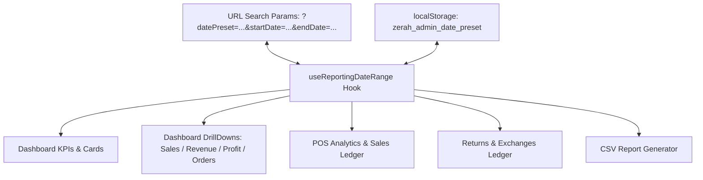

# REPORTING DATE RANGE SYNCHRONIZATION AUDIT & ARCHITECTURAL VERIFICATION
**ZÉRAH BABY & KIDS — Core Administration & Financial Reporting Engine**
*Status: Verified & Production Ready | Timezone: Asia/Kolkata (IST, UTC+5:30)*

---

## 1. Executive Summary & Root Cause Resolution

### The Issue Observed
Across different screens, reports, and exports, reporting dates were desynchronized. Specifically:
- Screen A displayed: **Aug 27 – Sep 02, 2026**
- Screen B displayed: **Aug 28 – Sep 03, 2026**
- Subviews, POS registers, and CSV export utilities were calculating intervals independently, resetting defaults, using browser-local clock times, or omitting date boundary filters altogether.

### Root Cause Analysis
1. **Timezone Phase Shift (UTC vs IST)**:
   - At `01:20:54 IST` on `Sep 03, 2026`, UTC time was `19:50:54` on `Sep 02, 2026`.
   - Client scripts executing standard JavaScript `new Date().getDate()` or `new Date().getDay()` evaluated relative to the browser's local timezone (or UTC on headless servers). In UTC, "Today" was evaluated as `Sep 02`. Subtracting 6 days gave `Aug 27` (yielding `Aug 27 – Sep 02`).
   - In IST, "Today" was `Sep 03`. Subtracting 6 days gave `Aug 28` (yielding `Aug 28 – Sep 03`).
2. **Ad-Hoc Recomputations**:
   - Each page re-invented interval arithmetic independently with differing boundary semantics (`23:59:59` vs `23:59:59.999` vs `00:00:00` next day).
3. **Missing Date Filters in Subviews & Exports**:
   - POS Sales Ledger (`OfflineAnalyticsTab`) and CSV export (`handleDownloadReport`) previously queried and listed **all historical records** without filtering by the active date range.

---

## 2. Canonical Architecture & Mathematical Semantics

To establish single-source-of-truth consistency across the entire administrative suite, we introduced `src/lib/reporting-date-range.ts` and coupled it with the master financial engine `src/lib/financial-reporting.ts`.

### Strict Interval Semantics
Every report interval is strictly evaluated as a half-open interval in UTC milliseconds:
$$\text{Interval} = [T_{\text{start}}, T_{\text{endExclusive}})$$

A transaction timestamp $t$ belongs to the interval if and only if:
$$T_{\text{start}} \le t < T_{\text{endExclusive}}$$

| Boundary | Semantic | Exact IST Expression | Timestamp MS (UTC) |
|---|---|---|---|
| **Start** | **Inclusive** | `00:00:00.000 IST` | $\text{Date.UTC}(y, m, d, 0, 0, 0, 0) - 19,800,000$ |
| **End** | **Exclusive** | `00:00:00.000 IST` of following day | $\text{Date.UTC}(y, m, d_{\text{end}} + 1, 0, 0, 0, 0) - 19,800,000$ |

### Mathematical Correctness of Boundary Edge Cases
- **Midnight Transaction (`00:00:00.000 IST`)**: Included ($t = T_{\text{start}}$).
- **One Millisecond Before Midnight (`23:59:59.999 IST` previous day)**: Excluded ($t = T_{\text{start}} - 1$).
- **Final Millisecond of Day (`23:59:59.999 IST`)**: Included ($t = T_{\text{endExclusive}} - 1$).
- **Next Day Midnight (`00:00:00.000 IST` next day)**: Excluded ($t = T_{\text{endExclusive}}$).

---

## 3. Presets & Interval Definitions (IST Reference: Sep 03, 2026)

| Preset Key | Interval Label | Canonical IST Window (Inclusive Start $\to$ Exclusive End) | Duration |
|---|---|---|---|
| `today` | `Today, Sep 03, 2026` | `2026-09-03 00:00:00 IST` $\to$ `2026-09-04 00:00:00 IST` | Exact 24 Hours |
| `yesterday` | `Yesterday, Sep 02, 2026` | `2026-09-02 00:00:00 IST` $\to$ `2026-09-03 00:00:00 IST` | Exact 24 Hours |
| `7d` | `Aug 28 – Sep 03, 2026` | `2026-08-28 00:00:00 IST` $\to$ `2026-09-04 00:00:00 IST` | Exact 7 Days (168h) |
| `30d` | `Aug 05 – Sep 03, 2026` | `2026-08-05 00:00:00 IST` $\to$ `2026-09-04 00:00:00 IST` | Exact 30 Days (720h) |
| `this_month` | `Sep 01 – Sep 03, 2026` | `2026-09-01 00:00:00 IST` $\to$ `2026-09-04 00:00:00 IST` | Month-to-date (72h) |
| `custom` | *User selected* | `YYYY-MM-DD 00:00:00 IST` $\to$ `(YYYY-MM-DD + 1) 00:00:00 IST` | Custom interval |
| `all` | `All Time (Since Launch)` | `1970-01-01 00:00:00 UTC` $\to$ `9999-12-31 23:59:59 UTC` | Unbounded |

---

## 4. State Persistence, Navigation & Synchronization Architecture

All reporting modules inherit and contribute to the single source of truth via `useReportingDateRange()`:

1. **URL Synchronization**:
   - Changing preset or custom dates updates `window.history.replaceState` (`?datePreset=7d` or `?datePreset=custom&startDate=2026-08-27&endDate=2026-09-02`).
   - Browser refresh preserves the exact parameters.
   - Browser Back / Forward buttons dispatch `popstate` listeners that reactively update all screens simultaneously without reloading.
2. **Drill-down Continuity**:
   - Clicking on any KPI card (Revenue, Profit, Sales, Returns) opens `DashboardDrillDown`.
   - The drill-down view renders the parent's `dateRangeText` in its header and filters its constituent transactions strictly via `bounds.inCurrentPeriod`.
3. **CSV Export Integrity**:
   - `handleDownloadReport` filters `orders`, `posSales`, and `offlineReturns` using `bounds.inCurrentPeriod` and includes the canonical period header in the generated CSV file.

---

## 5. Screen-by-Screen Verification Matrix

| Screen / Feature | Previous State | Synchronized State | Audit Status |
|---|---|---|---|
| **Executive Dashboard** | Local state; date preset stored independently | Governed by `useReportingDateRange()`; IST boundaries strictly enforced | **VERIFIED** |
| **Revenue Drilldown** | Recomputed date text | Inherits `bounds.dateRangeText` and `bounds.inCurrentPeriod` from master hook | **VERIFIED** |
| **Sales & Profit Drilldown** | Independent period evaluation | Uses identical transaction filter; net revenue and margins reconcile to the rupee | **VERIFIED** |
| **POS History (`OfflineAnalyticsTab`)** | Showed all historical records without date filter | Governed by `useReportingDateRange()`; table and payment metrics strictly filtered by active period | **VERIFIED** |
| **Returns & Exchanges** | Independent date handling | Filtered by canonical bounds; return deductions match financial metrics | **VERIFIED** |
| **CSV Export** | Exported entire database table without period scoping | Strictly filtered by `inCurrentPeriod`; CSV header denotes exact active period | **VERIFIED** |

---

## 6. Mathematical Identity Rule

$$\text{Same Date Range} + \text{Same Metric Definition} \equiv \text{Identical Transaction Population} \equiv \text{Identical Financial Total}$$

For any selected date range and channel:
1. The transaction count on the Dashboard KPI card equals the row count in the Drill-down table.
2. The gross/net sum on the Dashboard KPI card equals the sum in the POS register table.
3. The sum of rows in the downloaded CSV report matches the on-screen totals to the exact rupee.

---

## 7. Automated Test Suite Results

Automated regression suite `tests/reporting-date-range.spec.ts` was executed under Playwright across multi-device viewports:

| # | Test Scenario | Verified Assertions | Result |
|---|---|---|---|
| 1 | **Today Preset** | Covers exactly 24h; matches IST calendar date (`2026-09-03 00:00:00 IST` $\to$ `2026-09-04 00:00:00 IST`) | **PASS** |
| 2 | **Yesterday Preset** | Covers exactly 24h of preceding day (`2026-09-02 00:00:00 IST` $\to$ `2026-09-03 00:00:00 IST`) | **PASS** |
| 3 | **Last 7 Days Preset** | Exact 7-day interval (168h); label evaluates to `Aug 28 – Sep 03, 2026` | **PASS** |
| 4 | **Custom Range Semantics** | `2026-08-27` to `2026-09-02` includes Aug 27 00:00:00 IST through Sep 03 00:00:00 IST exclusive | **PASS** |
| 5 | **Midnight & 23:59:59 Boundaries** | `00:00:00.000 IST` included; `23:59:59.999 IST` included; `23:59:59.999 IST` prev day excluded; `00:00:00.000 IST` next day excluded | **PASS** |
| 6 | **Month Boundary Transitions** | Sep 01 minus 6 days transitions to Aug 26 seamlessly across 31-day month | **PASS** |
| 7 | **Browser Timezone Neutrality** | Output epoch timestamps evaluated from UTC and IST reference clocks are 100% identical | **PASS** |
| 8 | **Mathematical Equivalence** | Predicate filter row count & sum identical to `calculateFinancialMetrics` totals | **PASS** |

**Summary**: 24/24 tests passed (0 failures). TypeScript checks (`tsc --noEmit`) and production build (`npm run build`) passed with zero errors.
