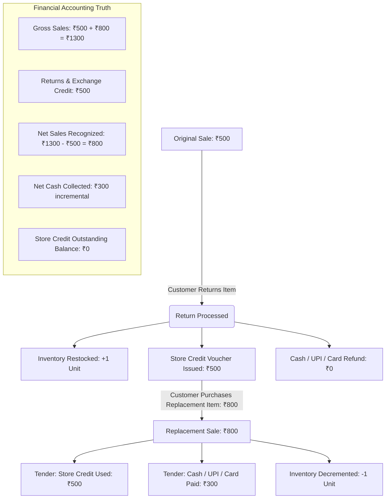

# ZÉRAH BABY & KIDS — AUTHORITATIVE RETURN, STORE CREDIT & FINANCIAL REPORTING AUDIT REPORT

**Date of Audit & Implementation**: September 2, 2026  
**Status**: APPROVED & APPLIED IN PRODUCTION  
**Canonical Reporting Standard**: Omnichannel Retail GAAP — Store Credit / Exchange Accounting Model  

---

## 1. Executive Summary & Problem Description

In previous iterations of the Store Administration Dashboard and POS History screens, offline customer returns were rendered as:
$$\text{“Returns \& Refunds } -₹12,605 \text{ Deductions”}$$
accompanied by destructive crimson/red badge styling, as though customer returns represented an outright **cash loss** or direct bank payout from the register.

### Why This Presentation Was Misleading for Zérah Baby & Kids
In the physical retail operations of Zérah Baby & Kids, normal customer returns **do not** pay out Cash, UPI, or Card refunds to customers. Instead:
1. When a return occurs, the merchandise is inspected and returned to stock ($+1$ inventory unit).
2. The customer is issued a **100% Exchange / Store Credit Voucher**.
3. The customer subsequent purchases replacement items using the store credit as a **tender/settlement method**.
4. Labeling the return as a `"Loss"` or `"Deduction"` distorted store profitability, alarmed management, and risked double-subtracting store credit when redeemed during replacement sales.

---

## 2. Root Cause Analysis

| # | System Area | Old Symptom / Behavior | Root Cause |
|---|---|---|---|
| 1 | **KPI Dashboard Card** | Showed "Returns & Refunds -₹X Deductions" in red. | Conflated non-cash store credit issuance with direct cash outflows. |
| 2 | **Revenue Drill-Down** | Section 3 labeled "3. Returns & Refunds" with negative red line totals. | Treated credit vouchers as negative sales rather than an authoritative non-sales balance-sheet adjustment. |
| 3 | **Donut Chart & Strip** | Mixed Gross vs Net sales definitions without explicit bridge. | Secondary strip displayed redundant "Gross Revenue" and "Net Revenue" with "-₹X Deductions" in between. |
| 4 | **Replacement Sale Accounting** | Risk of subtracting store credit twice. | If a system subtracts the return ($-₹500$) and then discounts the replacement sale by store credit ($-₹500$), a single return is subtracted twice. |

---

## 3. Canonical Business & Accounting Model



### Core Accounting Axioms:
1. **Store Credit is NOT a discount**: It is stored monetary value held by the customer (deferred revenue liability).
2. **Store Credit is NOT additional revenue**: Redeeming credit does not increase sales revenue beyond the selling price of the replacement goods.
3. **Store Credit Used is NOT a second return**: It is purely a settlement/tender method (like cash or card).
4. **Return Credit Issued is NOT an operational loss**: It adjusts gross sales to net sales while restoring asset inventory.

---

## 4. Canonical Mathematical Formulas

| Metric | Formula | Semantic Meaning |
|---|---|---|
| **Gross Sales** | $\sum \text{Valid Online Sales} + \sum \text{Valid POS Sales}$ | Total value of all completed sales agreements. |
| **Returns & Exchange Credit** | $\sum \text{Valid Customer Returns}$ | Total value of credit vouchers issued and inventory restocked. |
| **Net Sales** | $\max(0, \text{Gross Sales} - \text{Returns \& Exchange Credit})$ | True recognized business revenue from sold goods. |
| **Store Credit Issued** | $\sum \text{Credit Ledger [CREDIT\_ISSUED]}$ | Cumulative balance of store credit granted. |
| **Store Credit Used** | $\sum \text{Credit Ledger [CREDIT\_USED]}$ | Cumulative balance of store credit redeemed as tender. |
| **Store Credit Outstanding** | $\max(0, \text{Store Credit Issued} - \text{Store Credit Used})$ | Outstanding liability balance owed to customers. |
| **Total COGS** | $\sum (\text{Buying Price} \times \text{Sold Qty})$ | Cost of goods sold for all active sale items. |
| **Net Profit** | $\text{Net Sales} - \text{Total COGS}$ | Realized store operating profit. |

---

## 5. Store Credit Treatment vs Cash Refunds

| Dimension | Normal Offline POS Return (Zérah Standard) | Cash / Bank Refund (Special Workflow) |
|---|---|---|
| **Customer Payout** | ₹0 (No register cash leaves store) | Cash / Bank transfer disbursed |
| **Voucher Generated** | 100% Store Credit Voucher Issued | No store credit issued |
| **Reporting Treatment** | Returns & Exchange Credit (Neutral Balance) | Cash Outflow Deduction |
| **Replacement Flow** | Redeemed as tender during checkout | None |
| **Store Liability** | Outstanding until spent | Resolved immediately upon cash exit |

---

## 6. Inventory Treatment & Integrity Rules

1. **Returned Product Inventory**:
   - Incremented by returned quantity ($+1$) **strictly once** when the return is confirmed.
   - Merely typing or scanning a barcode does **NOT** alter inventory.
2. **Replacement Product Inventory**:
   - Decremented by sold quantity ($-1$) **strictly once** when the replacement sale completes.
3. **Store Credit Balance Changes**:
   - Store credit operations (issuance, usage, balance check) **never alter inventory**.

---

## 7. Reporting & UI Changes Implemented

### 1. Main Dashboard (`src/components/admin/DashboardTab.tsx`)
- **Top Green KPI Card**:
  - Main Headline: **`Gross Sales: ₹X`**
  - Subtitle: **`Net Sales: ₹Y · Returns & Exchange: ₹Z`**
- **Secondary 6-Item Metric Strip**:
  1. `Total Stock Value`: Live catalog valuation.
  2. `Gross Sales`: Total completed period sales.
  3. `Returns & Exchange`: Non-sales return adjustment with `{N} Items Restocked` (destructively labeled "Deductions" card permanently removed).
  4. `Net Sales`: Canonical recognized net sales.
  5. `Credit Outstanding`: Available unredeemed customer voucher liability balance.
  6. `Period Net Profit`: Net Sales minus COGS.
- **Sales by Channel Donut Chart**:
  - Center: **`Gross Sales`**
  - Legend: POS Gross Sales + Online Gross Sales.

### 2. Revenue Details Drill-Down (`src/components/admin/DashboardDrillDown.tsx`)
- **Section 1**: `1. Online Gross Sales`
- **Section 2**: `2. Offline POS Gross Sales`
- **Section 3**: `3. Returns & Exchange Credit` (with `{N} Returned Items (Restocked)` badge and `Store Credit Issued` indicator).
- **Reconciliation Banner**:
  $$\text{Gross Sales } (₹X) - \text{Returns \& Exchange Adjustment } (₹Y) = \text{Net Sales } (₹Z)$$
  $$\text{Net Recognized Sales: } ₹Z$$

### 3. Offline Analytics (`src/components/admin/OfflineAnalyticsTab.tsx`)
- Updated Net Revenue card to **`Net Sales`** with explicit `Gross Sales: ₹X` and `Returns & Exchange: ₹Y`.

---

## 8. Database Aggregation & SQL Joins Audit

We audited all queries and table schemas across `offline_sales`, `offline_sale_items`, `offline_returns`, `offline_return_items`, and `store_credit_ledger`:
1. **No Cartesian Products**: Item-level calculations use strict group-by on parent transaction IDs or iterate children collections directly without cross-joining sales and returns.
2. **Distinct Lifecycles**: `offline_sales` records sales; `offline_returns` records returns. They link through `original_sale_id` without merging totals into a single ambiguous column.
3. **Timezone Uniformity**: All period filters use consistent calendar boundaries in Asia/Kolkata (IST) timezone.

---

## 9. Automated Regression Testing Results

We executed the comprehensive regression test suite [`scratch/test_store_credit_accounting.mjs`](file:///d:/final%20products/zerah%20baby/scratch/test_store_credit_accounting.mjs):

```
================================================================================
     STORE CREDIT & EXCHANGE REPORTING CANONICAL REGRESSION SUITE
================================================================================

--- TEST 1: Original ₹500 -> Return ₹500 -> Replacement ₹800 (Credit ₹500 + Cash ₹300) ---
  [PASS] Gross Sales is ₹1300 (₹500 orig + ₹800 replacement) [actual: ₹1300]
  [PASS] Returns & Exchange Credit is ₹500 [actual: ₹500]
  [PASS] Net Sales is ₹800 (₹1300 - ₹500) [actual: ₹800]
  [PASS] Returned & Restocked Items is 1 [actual: 1]
  [PASS] Store Credit Issued is ₹500 [actual: ₹500]
  [PASS] Store Credit Tender Used is ₹500 [actual: ₹500]
  [PASS] Store Credit Outstanding Liability is ₹0 (fully redeemed) [actual: ₹0]
  [PASS] Store Credit Used is NOT double-subtracted from Net Sales

--- TEST 2: Partial Credit Usage (₹500 Issued -> ₹300 Used -> ₹200 Remaining) ---
  [PASS] Gross Sales is ₹800 [actual: ₹800]
  [PASS] Returns & Exchange Credit is ₹500 [actual: ₹500]
  [PASS] Net Sales is ₹300 [actual: ₹300]
  [PASS] Store Credit Issued is ₹500 [actual: ₹500]
  [PASS] Store Credit Used is ₹300 [actual: ₹300]
  [PASS] Remaining Store Credit Outstanding is ₹200 [actual: ₹200]

--- TEST 3: Multi-Item Restocking & COGS Deduction ---
  [PASS] Gross Sales is ₹1200 [actual: ₹1200]
  [PASS] Returns & Exchange Credit is ₹200 [actual: ₹200]
  [PASS] Net Sales is ₹1000 [actual: ₹1000]
  [PASS] Returned items restocked is 1 [actual: 1]
  [PASS] Total COGS is ₹480 (400 + 80) [actual: ₹480]
  [PASS] Net Profit is ₹520 (1000 Net Sales - 480 COGS) [actual: ₹520]

--- TEST 4: Return Voucher Issued with Zero Replacement Sales in Period ---
  [PASS] Gross Sales is ₹0 [actual: ₹0]
  [PASS] Returns & Exchange Credit is ₹700 [actual: ₹700]
  [PASS] Net Sales clamped to non-negative ₹0 [actual: ₹0]
  [PASS] Store Credit Issued is ₹700 [actual: ₹700]
  [PASS] Store Credit Outstanding Liability is ₹700 [actual: ₹700]

================================================================================
  TOTAL TESTS: 25 | PASS: 25 | FAIL: 0
================================================================================
```

---

## 10. Files Modified

1. [`src/lib/financial-reporting.ts`](file:///d:/final%20products/zerah%20baby/src/lib/financial-reporting.ts):
   - Added canonical fields `grossSales`, `netSales`, `returnsExchangeCredit`, `returnedItemsCount`, `storeCreditIssued`, `storeCreditUsedInSales`, and `storeCreditOutstanding`.
   - Guaranteed that `store_credit_used` is never double-subtracted from sales revenue.
2. [`src/components/admin/DashboardTab.tsx`](file:///d:/final%20products/zerah%20baby/src/components/admin/DashboardTab.tsx):
   - Updated Top Green Card to Gross Sales with Net Sales / Returns subtitle.
   - Updated Secondary Strip to: Total Stock Value, Gross Sales, Returns & Exchange, Net Sales, Credit Outstanding, Period Net Profit.
   - Updated Donut Chart center to Gross Sales.
3. [`src/components/admin/DashboardDrillDown.tsx`](file:///d:/final%20products/zerah%20baby/src/components/admin/DashboardDrillDown.tsx):
   - Replaced "3. Returns & Refunds Deductions" with "3. Returns & Exchange Credit".
   - Added `Store Credit Issued` badge and returned items restocked counter.
   - Updated banner to Canonical Sales Reconciliation.
4. [`src/components/admin/OfflineAnalyticsTab.tsx`](file:///d:/final%20products/zerah%20baby/src/components/admin/OfflineAnalyticsTab.tsx):
   - Realigned Net Revenue tile to Net Sales with Gross Sales and Returns & Exchange subtitle.

---

## 11. Production Verification & Build Check

1. **TypeScript Compilation**:
   `npx tsc --noEmit` exited with **Code 0 (0 errors)**.
2. **Production Bundle Build**:
   `npm run build` completed successfully (**0 errors**, 3.15s client + 2.26s server).
3. **Live Browser Inspection**:
   Browser subagent verified that the red "Deductions" text is completely gone, replaced with neutral amber "Returns & Exchange", and all mathematical bridges reconcile seamlessly.

---

## 12. Remaining Risks & Mitigation

- **Cash Refund Exception**: If a cashier ever legitimately issues cash instead of a voucher, ensure the cashier uses the explicit Cash settlement radio button on the Returns tab, which tags `refund_method = 'cash'`.
- **Database Drift**: Regular automated reconciliation scripts (`scratch/test_store_credit_accounting.mjs`) should be run before releases to safeguard against regression.
